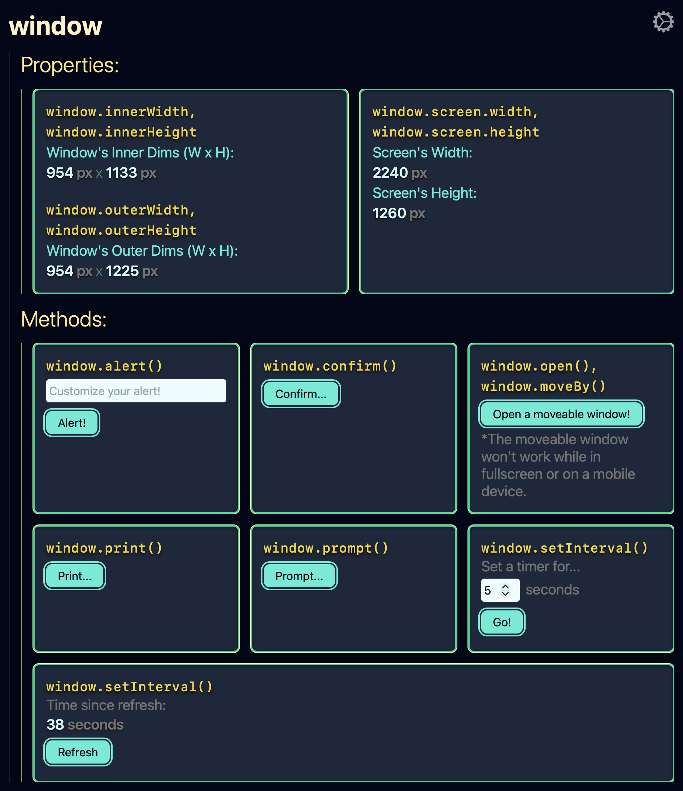
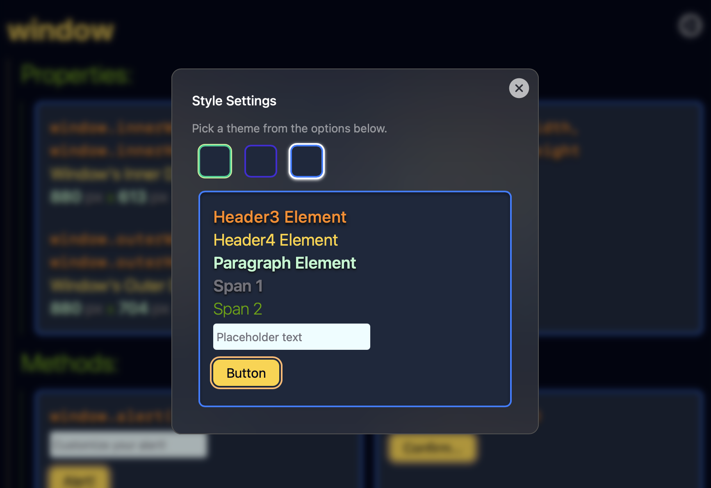
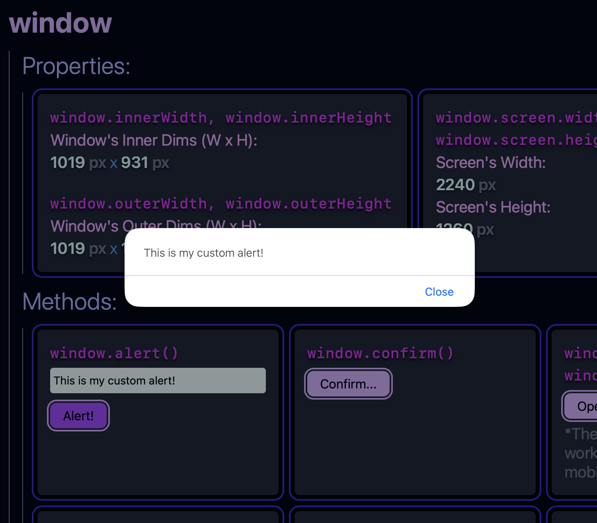

# Properties and Methods of the Window, Document, and Navigator Interfaces

## Description

This is a dashboard-style React application that allows users to see and interact with some of the properties and methods of the browser's Window, Document, and Navigator interfaces.

## Usage

Run the app with Vite using the 'npm run dev' script and open it in a browser. Play with the various widgets to explore properties and methods of the browser's Window, Document, and Navigator interfaces!

## License

This repository uses an [MIT License ↗️](./LICENSE.txt).