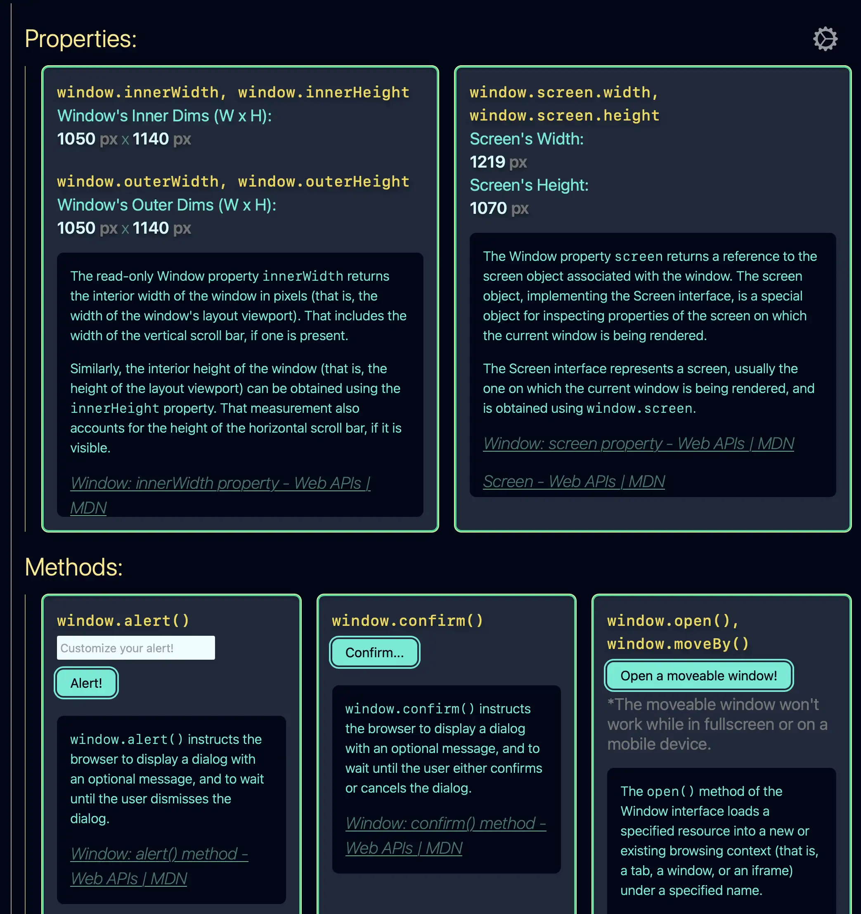
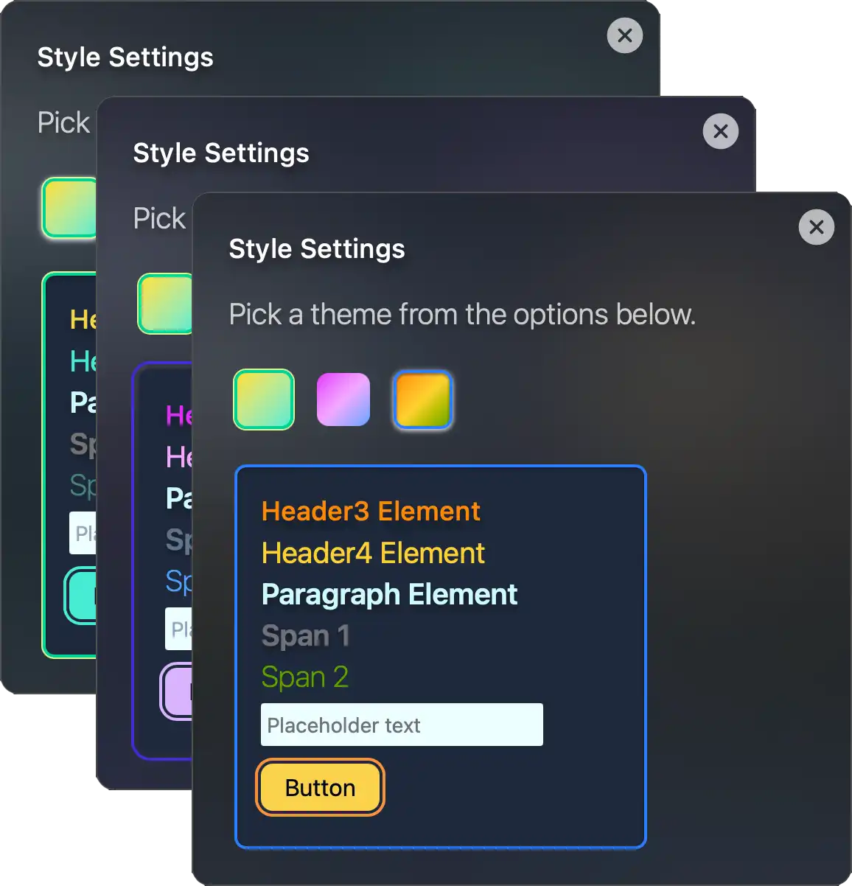
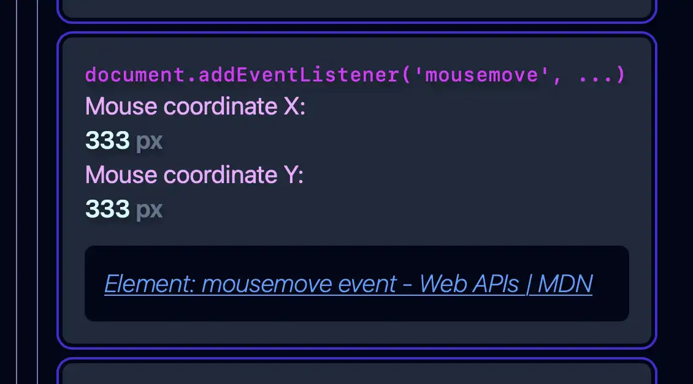
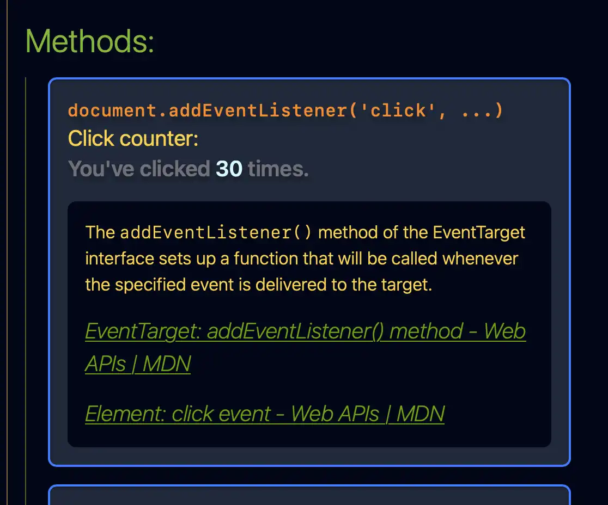
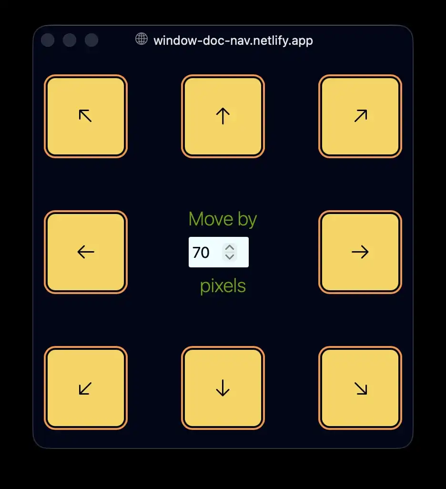
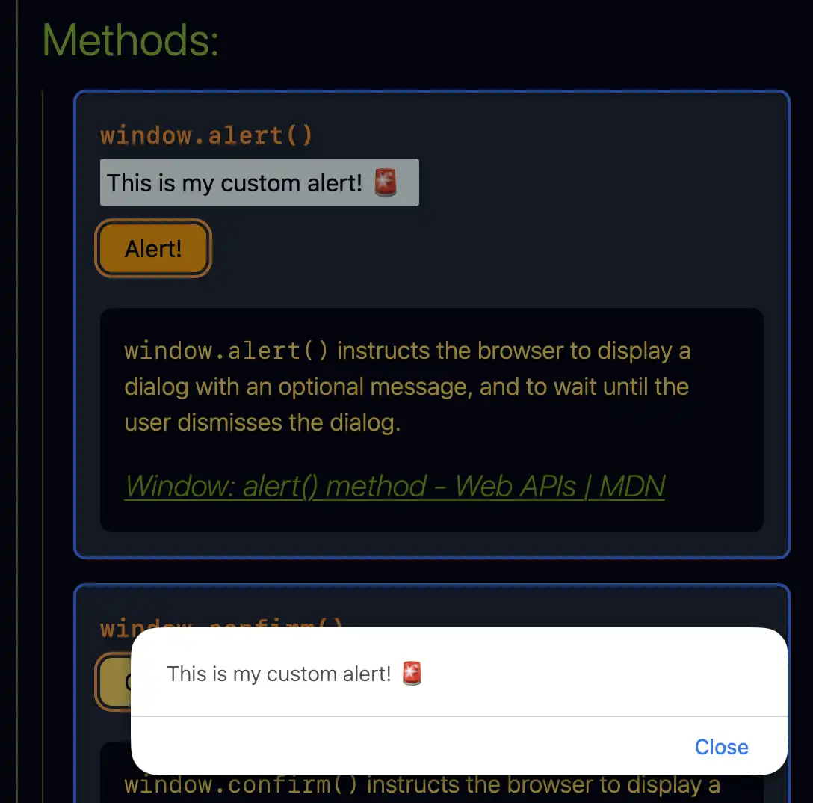

# Common Properties and Methods of the Window, Document, and Navigator Web APIs

## Description

This is an interactive dashboard exploring common web APIs, including the [Window interface](https://developer.mozilla.org/en-US/docs/Web/API/Window), the [Document interface](https://developer.mozilla.org/en-US/docs/Web/API/Document), and the [Navigator interface](https://developer.mozilla.org/en-US/docs/Web/API/Navigator).

It includes three style options. The user's style preference is saved to the browser's local storage.

## Usage

[Check out the website!](https://window-doc-nav.netlify.app/) Play with the various widgets to explore properties and methods of the browser's Window, Document, and Navigator interfaces!

## License

This repository uses an [MIT License ↗️](./LICENSE.txt).
